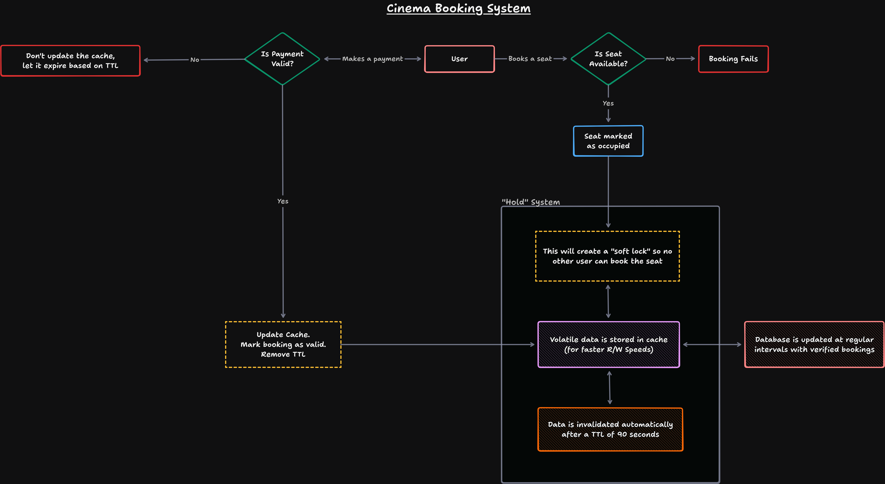

# Cinema Booking System

A high-performance cinema seat booking system designed to handle concurrency, prevent double-bookings, and ensure data consistency using a **cache-based soft lock mechanism**.

## Overview

This system uses a **"hold" (soft lock) strategy** backed by a cache layer to temporarily reserve seats during the booking process. It ensures:

* No two users can book the same seat simultaneously
* Fast read/write performance using cache
* Automatic expiration of unconfirmed bookings via TTL

## Tech Stack

* **Backend:** Go (Echo + Air)
* **Cache Layer:** Valkey
* **Database:** PostgreSQL
* **Containerization:** Docker
* **API Testing:** Postman

## Architecture & Flow

### 1. Seat Booking Flow

1. User initiates a booking

2. System checks if the seat is available

   * ❌ If not → Booking fails
   * ✅ If yes → Proceed

3. Seat is **soft-locked (held)** using cache

4. Payment is processed

### 2. Payment Handling

* ❌ **Payment Failed**

  * Cache is **NOT updated**
  * Seat hold expires automatically via TTL

* ✅ **Payment Successful**

  * Cache is updated:

    * Booking marked as **confirmed**
    * TTL removed
  * Database is updated via **write-through cache**

### 3. Hold System (Core Concept)

* Seat data is stored in **Valkey cache**
* A **soft lock** is applied when a user selects a seat
* Lock prevents other users from booking the same seat
* Each lock has a **TTL (e.g., 90 seconds)**

#### If user doesn’t complete payment:

* Cache entry expires automatically
* Seat becomes available again

Simplified System Design:


## Features

* Prevents double booking with soft locks
* High-speed access via cache layer
* Automatic expiration using TTL
* Write-through caching for consistency
* Fully containerized with Docker
* Easy API testing via Postman

## Running with Docker

```bash
docker compose up --build
```

Services:

* Go API
* Valkey (cache)
* PostgreSQL

## Design Decisions

### Why Cache for Locking?

* Faster than DB locks
* Scales better under high concurrency
* TTL prevents deadlocks automatically

### Why Write-Through Cache?

* Ensures DB consistency
* Keeps cache and DB in sync

### Why TTL Instead of Manual Unlock?

* Handles user drop-offs gracefully
* No need for cleanup jobs

## Future Improvements

* Distributed locking (e.g., Redlock)
* Retry mechanisms for failed payments
* Event-driven architecture (Kafka/NATS)
* Seat map visualization
* Rate limiting & abuse protection
